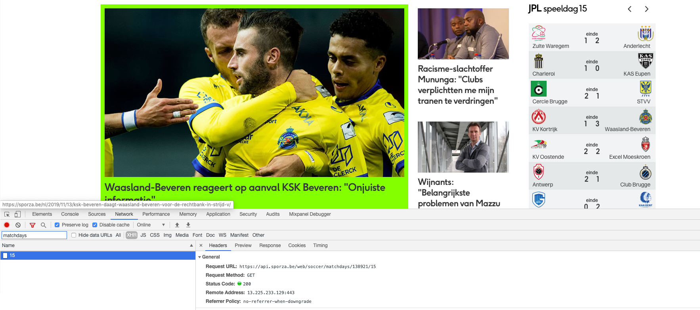
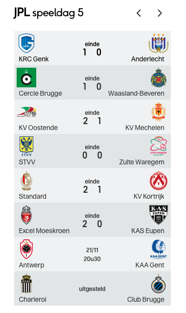
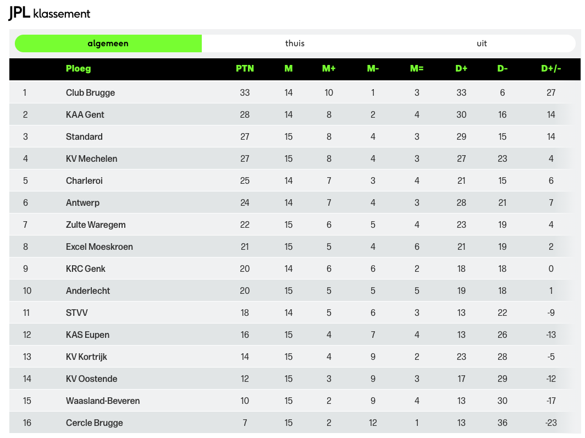

Standard chunk options except for:

- caching which is enabled
- warnings are disabled

Some warnings are just about the coercion of for example integers into character vectors. These warnings are not relevant before transforming so better not to let them pollute the report.

```{r, include = FALSE}
knitr::opts_chunk$set(
  cache = TRUE,
  warning = FALSE,
  collapse = TRUE,
  comment = "#>"
)
```

```{r setup}
library(possibleRankChanges)
library(magrittr)
```

# Inspiration

I've been looking for some time to:

- reproduce an interesting graph in `ggplot2`
- do some analysis around sports

Stumbled upon [this post](https://www.reddit.com/r/dataisbeautiful/comments/a9n0rv/this_season_ive_been_creating_these_possible/) on r/dataisbeautiful and it seemed like a very fitting candidate. It's immediately clear what the data is telling you even though it's about intervals. 

However, I'd like to adapt it in a couple of ways:

- use data of Belgian Jupiler Pro League instead of Premier League
- not bother with form, points, ... (detracts from the main point)
- make it more dynamic with several gameweeks

# Steps

Roughly these are the steps to take:

- get data
  - league table at this moment
  - upcoming games till the end of the season
- simulate all the different game outcomes possible
- pick the best and worst outcome per team
- visualize

Let's start off simple as in the Reddit post by just focusing on the next game. If the code is written the right way it will be easy later on to make it more dynamic.

# Get data

Data can be found at [Sporza](https://sporza.be/nl/categorie/voetbal/jupiler-pro-league/). Sporza doesn't have its own official API but has an official one called at `https://api.sporza.be`. You can discover it for yourself by using for example the Chrome DevTools.



An endpoint exists to get the games in a gameweek (`/matchdays/{seasonId}/{gameweekId}`). There's no endpoint to get the league table. Since a league table is not too dynamic (you don't often scroll back to previous gameweeks to see what the table looked like at that moment) it's part of the HTML request. Instead of trying to parse this HTML I opted to reconstruct the league table based on the games played. That way I only have to focus on the `/matchdays` endpoint.

I'm most used to using the `requests` package in Python for making API calls. Since gathering the data is only a small part of this package I opted to stay within the R ecosystem. [httr](https://cran.r-project.org/web/packages/httr/vignettes/quickstart.html) is an R package inspired by `requests`.

## Current league table

### Game results up till now

To get the current league table we first have to get the results of all games played up till now (gameweek 15). For each game we get:

- home team name
- away team name
- home score
- away score
- gameweek

Let's first see if we can make it work for a single game. 138921 is the season id of the current season.

```{r}
get_matchdays(gameweek_id = "1", season_id = "138921") %>% 
  parse_games %>% 
  .[[1]] %>% # just focus on a single game at the moment
  parse_game_result
  
```

Note `parse_game_result` contains a check to see if the game actually took place. Games can be postponed in which case only the team names and gameweek will be available but there obviously won't be any score info.

If we want to scale things up it helps to think about the sequence:

- get responses of all matchdays
- parse all the games of each matchday
- parse the results of all game

As you can see all is mentioned thrice meaning there's thrice times a need for iteration. [purrr](https://purrr.tidyverse.org/) is very convenient for this. 

We don't bother with lists or vectors but directly return the game results in a dataframe format. This might make things less efficient but it greatly helps in making the code understandable.

Functions containing `all` in their name are iterating functions. `parse_all_games` also flattens. If not we end up with a list of games within a list of responses. We don't care about this structure but just about the games themselves so it makes sense to [remove a level of hierarchy](https://purrr.tidyverse.org/reference/flatten.html).

```{r}
gameweek_ids <- seq(from = 1, to = 15) %>% as.character
season_id <- "138921"

list_game_results <- gameweek_ids %>%
  get_all_matchdays(season_id) %>% 
  parse_all_games %>% 
  parse_all_game_results
```

We get a list of game results but would rather have them all merged in a single dataframe. Makes it easier to apply `tidyverse` functions to it.

```{r}
game_results <- list_game_results %>% 
  games_to_df
```

Let's make quick check. We asked for 15 gameweeks. There are 16 teams in competition meaning 8 games per gameweek.

```{r}
game_results %>%
  dplyr::group_by(gameweek) %>%
  dplyr::summarise(n = n())
```

We get what we except for gameweek 5 in which only 6 games were played. This is correct since 2 games were postponed:



### Create league table

Now we have the results of all the games played so far. Let's count the total points by team to get the league table.

First step is to add the home points and away points variables. Right now we just have the score (goals scored for home and away teams) but no info about the points distributed at the end of the game.

```{r}
game_results <- game_results %>% 
  add_home_points %>% 
  add_away_points
```

As an intermediate step we create 2 league tables: one for home, one for away.

```{r}
home_league_table <- game_results %>%
  create_home_league_table
away_league_table <- game_results %>%
  create_away_league_table
```

These can be merged into a single league table.

```{r}
league_table <- create_league_table(home_league_table,
                                    away_league_table)

print(league_table %>%
        dplyr::arrange(desc(total_points)))
```

This matches what can be found on the Sporza site.



There are some small discrepancies in case of a rank tie. This does not matter at the moment.

## Upcoming games

The first part of getting the data is done by creating the league table. The second part of getting the upcoming games is made a lot easier since most of the functions used have been written already. We just have to add a function `parse_upcoming_game` to get a limited version of the game info (because by definition there won't be a score yet).

```{r}
upcoming_gameweek_ids <- seq(from = 16, to = 30) %>% as.character
season_id <- "138921"

list_upcoming_games <- upcoming_gameweek_ids %>%
  get_all_matchdays(season_id) %>% 
  parse_all_games %>% 
  parse_all_upcoming_games
```

There's some duplication in code between the `parse_game_result` and `parse_upcoming_game` functions. Refactoring might take some time and things are still pretty clear at the moment so I leave it at that.

Once again merge the list of dataframes into a single dataframe.

```{r}
upcoming_games <- list_upcoming_games %>% 
  games_to_df
```

# Simulate game outcomes

Now on to the fun part. Let's simulate all the league tables possibles for the next game. The Jupiler League has 16 teams so there are as mentioned above 8 games per gameweek. Each game has 3 possible outcomes: win, draw or loss. This means we have to simulate 3 ** 8 different league table outcomes for the next gameweek. So 6561 possible league tables.

